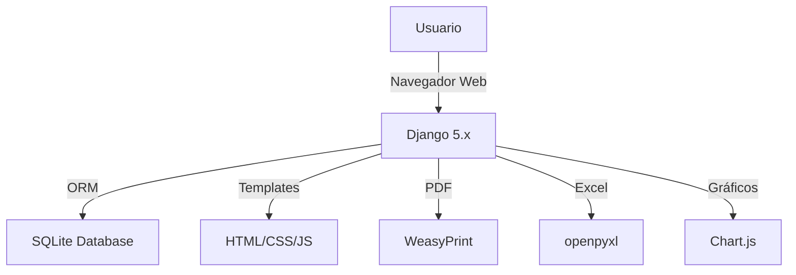
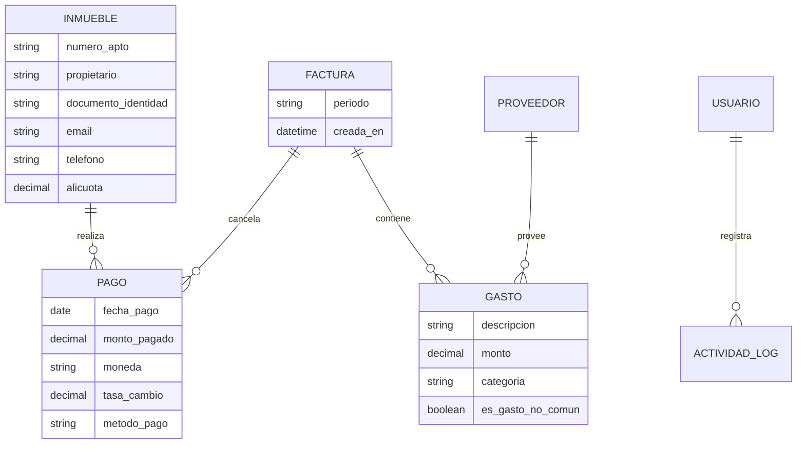
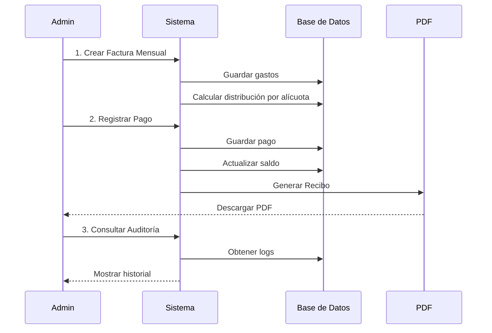
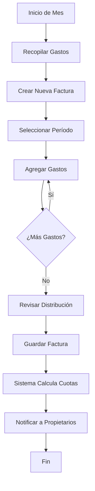
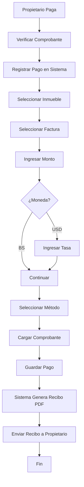
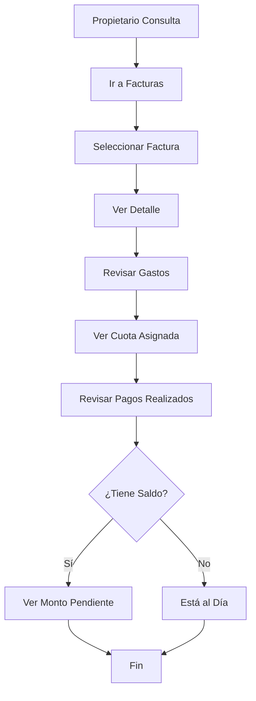
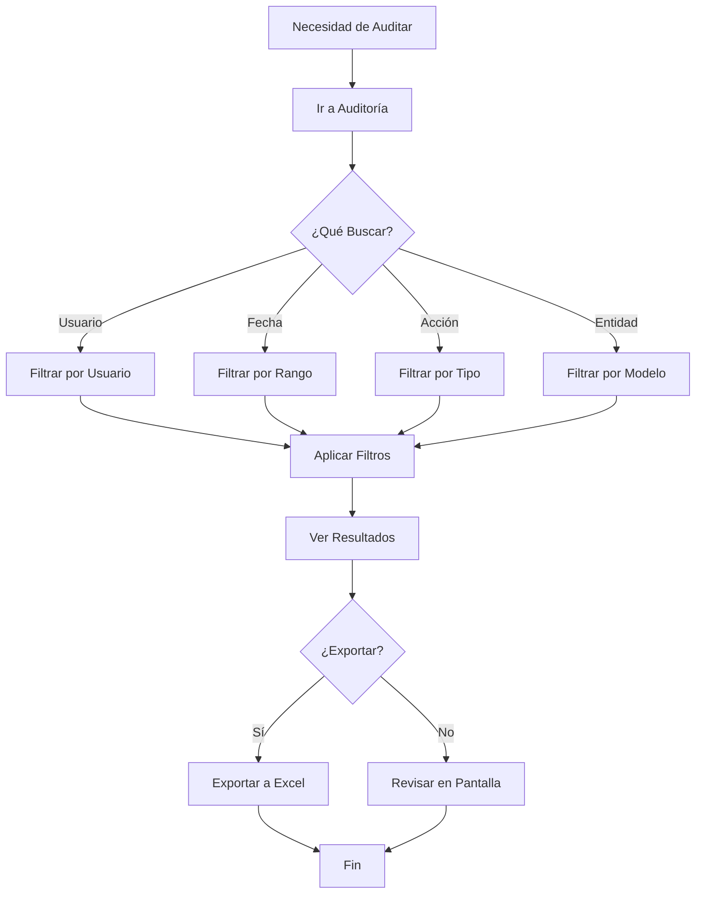

# MANUAL DE USUARIO
# Sistema de Administración de Condominios (SAC WEB)

**Versión:** 1.0  
**Fecha:** Enero 2026  
**Desarrollado para:** Condominio Santa Ana de Coro  
**Proyecto de Tesis:** Universidad [Nombre]

---

## 📋 Índice

1. [Introducción](#introducción)
2. [Arquitectura del Sistema](#arquitectura-del-sistema)
3. [Acceso al Sistema](#acceso-al-sistema)
4. [Dashboard Principal](#dashboard-principal)
5. [Módulo de Inmuebles](#módulo-de-inmuebles)
6. [Módulo de Facturas y Gastos](#módulo-de-facturas-y-gastos)
7. [Módulo de Pagos y Recibos](#módulo-de-pagos-y-recibos)
8. [Módulo de Proveedores](#módulo-de-proveedores)
9. [Módulo de Usuarios](#módulo-de-usuarios)
10. [Sistema de Auditoría](#sistema-de-auditoría)
11. [Sistema de Notificaciones](#sistema-de-notificaciones)
12. [Exportaciones a Excel](#exportaciones-a-excel)
13. [Flujos de Trabajo Completos](#flujos-de-trabajo-completos)
14. [Preguntas Frecuentes](#preguntas-frecuentes)
15. [Glosario](#glosario)

---

## 1. Introducción

### 1.1 ¿Qué es SAC WEB?

**SAC WEB** (Sistema de Administración de Condominios Web) es una aplicación web diseñada para **automatizar y simplificar la gestión administrativa de condominios**. 

### 1.2 Propósito del Sistema

El sistema fue creado para resolver los siguientes problemas comunes en la administración de condominios:

- ❌ **Problema:** Cálculos manuales de cuotas proporcionales (alícuotas)
- ✅ **Solución:** Cálculo automático basado en porcentajes configurables

- ❌ **Problema:** Generación manual de recibos de pago
- ✅ **Solución:** Generación automática de PDFs profesionales

- ❌ **Problema:** Falta de trazabilidad de acciones
- ✅ **Solución:** Sistema de auditoría que registra todas las operaciones

- ❌ **Problema:** Dificultad para generar reportes
- ✅ **Solución:** Exportación a Excel con un clic

### 1.3 Beneficios Clave

| Beneficio | Descripción |
|-----------|-------------|
| **Transparencia** | Todos los usuarios pueden ver el historial de cambios |
| **Eficiencia** | Automatización de cálculos y generación de documentos |
| **Trazabilidad** | Registro completo de quién hizo qué y cuándo |
| **Accesibilidad** | Acceso desde cualquier dispositivo con navegador web |
| **Profesionalismo** | Documentos PDF con diseño corporativo |

### 1.4 Usuarios del Sistema

El sistema está diseñado para ser usado por:

1. **Administrador del Condominio** - Acceso completo a todas las funciones
2. **Tesorero** - Gestión de pagos y finanzas
3. **Secretario** - Gestión de inmuebles y propietarios
4. **Auditor** - Consulta de registros y reportes

> [!NOTE]
> Actualmente, el sistema permite acceso completo a todos los usuarios autenticados, priorizando la **trazabilidad** sobre la restricción de acceso.

---

## 2. Arquitectura del Sistema

### 2.1 Tecnologías Utilizadas



**Stack Tecnológico:**
- **Backend:** Django 5.x (Python)
- **Frontend:** HTML5, CSS3, JavaScript puro
- **Base de Datos:** SQLite
- **Generación de PDFs:** WeasyPrint
- **Exportación Excel:** openpyxl
- **Gráficos:** Chart.js

### 2.2 Modelo de Datos

El sistema maneja 6 entidades principales:



### 2.3 Flujo de Datos Principal



---

## 3. Acceso al Sistema

### 3.1 Inicio de Sesión

**URL de acceso:** `http://127.0.0.1:8000/`

**Credenciales de ejemplo:**
- **Usuario:** admin
- **Contraseña:** [configurada durante instalación]

**Pasos:**
1. Abrir navegador web (Chrome, Firefox, Edge)
2. Navegar a la URL del sistema
3. Ingresar usuario y contraseña
4. Clic en "Iniciar Sesión"

> [!IMPORTANT]
> El sistema requiere autenticación. Sin credenciales válidas no se puede acceder a ninguna funcionalidad.

### 3.2 Cambiar Contraseña

**Ubicación:** Navbar superior → Nombre de usuario → "Cambiar Contraseña"

**Pasos:**
1. Clic en tu nombre de usuario (esquina superior derecha)
2. Seleccionar "Cambiar Contraseña"
3. Ingresar contraseña actual
4. Ingresar nueva contraseña (2 veces)
5. Clic en "Cambiar Contraseña"

**Requisitos de contraseña:**
- Mínimo 8 caracteres
- No puede ser completamente numérica
- No puede ser demasiado común

### 3.3 Cerrar Sesión

**Ubicación:** Navbar superior → Nombre de usuario → "Cerrar Sesión"

> [!CAUTION]
> Siempre cierra sesión al terminar, especialmente en computadoras compartidas.

---

## 4. Dashboard Principal

### 4.1 Visión General

El **Dashboard** es la página principal del sistema. Muestra un resumen ejecutivo de la situación financiera del condominio.


### 4.2 Componentes del Dashboard

#### 4.2.1 Tarjetas de Estadísticas

El dashboard muestra 4 tarjetas con métricas clave:

| Tarjeta | Qué Muestra | Para Qué Sirve |
|---------|-------------|----------------|
| **Total Inmuebles** | Cantidad de propiedades registradas | Verificar que todos los apartamentos estén en el sistema |
| **Total Facturas** | Cantidad de facturas emitidas | Llevar control de períodos facturados |
| **Total Recaudado** | Suma de todos los pagos (en Bs) | Ver cuánto dinero ha ingresado al condominio |
| **Deuda Pendiente** | Diferencia entre gastos y pagos | Identificar si hay déficit o superávit |

**Cálculo de Deuda Pendiente:**
```
Deuda Pendiente = Total Gastos - Total Recaudado
```

- **Positivo (rojo):** El condominio debe dinero (déficit)
- **Negativo (verde):** El condominio tiene superávit
- **Cero:** Gastos y pagos están balanceados

#### 4.2.2 Gráficos Interactivos

El dashboard incluye 3 gráficos que se actualizan automáticamente:

**1. Evolución de Pagos (Últimos 6 Meses)**
- **Tipo:** Gráfico de líneas
- **Qué muestra:** Total recaudado mes a mes
- **Para qué sirve:** Identificar tendencias de pago
- **Cómo leerlo:** 
  - Línea ascendente = Mayor recaudación
  - Línea descendente = Menor recaudación
  - Picos = Meses con pagos extraordinarios

**2. Top 10 Deudas por Inmueble**
- **Tipo:** Gráfico de barras horizontales
- **Qué muestra:** Los 10 inmuebles con mayor deuda
- **Para qué sirve:** Identificar morosos
- **Cómo leerlo:**
  - Barras más largas = Mayor deuda
  - Sin barras = Todos están al día

**3. Distribución de Gastos por Categoría**
- **Tipo:** Gráfico de dona
- **Qué muestra:** Porcentaje de gastos por tipo
- **Para qué sirve:** Entender en qué se gasta el dinero
- **Categorías:**
  - **Ordinario:** Gastos mensuales normales (limpieza, seguridad, etc.)
  - **Imprevisto:** Gastos inesperados (reparaciones urgentes)
  - **Extraordinario:** Gastos especiales aprobados (mejoras, proyectos)

#### 4.2.3 Accesos Rápidos

Botones para acceder directamente a las funciones más usadas:

- **🏢 Gestionar Inmuebles** → Lista de propiedades
- **💰 Ver Facturas** → Facturas mensuales
- **💳 Registrar Pagos** → Formulario de pago
- **📋 Gestionar Proveedores** → Lista de proveedores
- **👥 Gestionar Usuarios** → Administración de usuarios (solo administradores)
- **📊 Exportar Resumen Financiero** → Descarga Excel con resumen completo

---

## 5. Módulo de Inmuebles

### 5.1 ¿Qué es un Inmueble?

Un **inmueble** es cada propiedad individual dentro del condominio (apartamento, local comercial, oficina, etc.).

**Información que se guarda:**
- Número de identificación (ej: 1A, 2B, PH-1)
- Nombre del propietario
- Documento de identidad (RIF o Cédula)
- Email de contacto
- Teléfono
- **Alícuota** (porcentaje de participación en gastos comunes)
- Notas adicionales

### 5.2 ¿Qué es la Alícuota?

La **alícuota** es el porcentaje que cada inmueble debe pagar de los gastos comunes del condominio.

**Ejemplo:**
- Condominio con 20 apartamentos
- Gastos del mes: Bs 10,000
- Apartamento 1A tiene alícuota de 5.26% (0.0526)
- Apartamento 1A debe pagar: 10,000 × 0.0526 = **Bs 526**

> [!IMPORTANT]
> **La suma de todas las alícuotas DEBE ser exactamente 1.0 (100%)**. El sistema valida esto automáticamente.

### 5.3 Lista de Inmuebles


**Acceso:** Navbar → "Inmuebles"

**Qué muestra:**
- Tabla con todos los inmuebles registrados
- Información de cada propietario
- Alícuota de cada inmueble
- Botones de acción para cada fila

**Botones disponibles:**

| Botón | Color | Función |
|-------|-------|---------|
| **Ver** | Azul | Muestra detalles completos del inmueble |
| **Editar** | Amarillo | Permite modificar información |
| **Eliminar** | Rojo | Borra el inmueble (requiere confirmación) |

**Botones del encabezado:**
- **📊 Exportar Excel:** Descarga lista completa en formato .xlsx
- **+ Crear Inmueble:** Abre formulario para agregar nuevo inmueble

### 5.4 Crear Nuevo Inmueble

**Pasos:**
1. Clic en "+ Crear Inmueble"
2. Llenar formulario:
   - **Número de Apartamento:** Identificador único (ej: 1A, 2B)
   - **Nombre del Propietario:** Nombre completo
   - **Documento de Identidad:** RIF o Cédula (ej: V-12345678)
   - **Email:** Correo electrónico
   - **Teléfono:** Número de contacto
   - **Alícuota:** Porcentaje decimal (ej: 0.0526 para 5.26%)
   - **Notas:** Información adicional (opcional)
3. Clic en "Guardar"

**Validaciones automáticas:**
- ✅ Número de apartamento único (no puede repetirse)
- ✅ Email con formato válido
- ✅ Alícuota entre 0 y 1
- ⚠️ Advertencia si la suma de alícuotas no es 1.0

### 5.5 Editar Inmueble

**Pasos:**
1. En la lista, clic en "Editar" (botón amarillo)
2. Modificar campos necesarios
3. Clic en "Guardar Cambios"

> [!NOTE]
> Cada edición queda registrada en el sistema de auditoría con fecha, hora y usuario.

### 5.6 Eliminar Inmueble

**Pasos:**
1. Clic en "Eliminar" (botón rojo)
2. Confirmar eliminación en el diálogo
3. El inmueble se borra permanentemente

> [!CAUTION]
> **Esta acción NO se puede deshacer**. Solo elimina inmuebles que no tengan pagos asociados.

### 5.7 Exportar Inmuebles a Excel

**Pasos:**
1. Clic en "📊 Exportar Excel"
2. El archivo `inmuebles_YYYYMMDD.xlsx` se descarga automáticamente

**Contenido del Excel:**
- Todas las columnas de la tabla
- Formato profesional con encabezados azules
- Columnas auto-ajustadas
- Listo para imprimir o compartir

---

## 6. Módulo de Facturas y Gastos

### 6.1 ¿Qué es una Factura?

Una **factura** representa el período de facturación mensual del condominio. Contiene todos los gastos del mes que deben ser distribuidos entre los inmuebles.

**Estructura:**
```
Factura Enero 2026
├── Gasto 1: Mantenimiento de Ascensor (Bs 800)
├── Gasto 2: Limpieza de Áreas Comunes (Bs 600)
├── Gasto 3: Seguridad (Bs 1,200)
└── Gasto 4: Servicios Básicos (Bs 400)
    TOTAL: Bs 3,000
```

### 6.2 Tipos de Gastos

| Categoría | Descripción | Ejemplo |
|-----------|-------------|---------|
| **Ordinario** | Gastos mensuales normales | Limpieza, seguridad, mantenimiento |
| **Imprevisto** | Gastos inesperados | Reparación urgente de tubería |
| **Extraordinario** | Gastos especiales aprobados | Pintura del edificio, mejoras |

### 6.3 Gastos Comunes vs. No Comunes

**Gasto Común:**
- Se distribuye entre **todos** los inmuebles según alícuota
- Ejemplo: Limpieza de áreas comunes

**Gasto No Común:**
- Solo lo paga **un inmueble específico**
- Ejemplo: Reparación de tubería del apartamento 3B

### 6.4 Crear Nueva Factura


**Acceso:** Navbar → "Facturas" → "+ Crear Factura"

**Pasos:**
1. Seleccionar **Período** (formato YYYY-MM, ej: 2026-01)
2. Agregar gastos uno por uno:
   - Clic en "+ Agregar Gasto"
   - Llenar formulario de gasto:
     - **Descripción:** Qué se pagó
     - **Monto:** Cantidad en Bs
     - **Categoría:** Ordinario/Imprevisto/Extraordinario
     - **¿Es gasto no común?:** Marcar si solo aplica a un inmueble
     - **Inmueble específico:** Seleccionar si es gasto no común
     - **Proveedor:** Opcional, a quién se le pagó
3. Ver resumen automático:
   - Total de gastos
   - Distribución por inmueble (calculada automáticamente)
4. Clic en "Crear Factura"

**Cálculo Automático:**

El sistema calcula cuánto debe pagar cada inmueble:

```
Para gastos comunes:
Monto del inmueble = Total gastos comunes × Alícuota del inmueble

Para gastos no comunes:
Monto del inmueble = Monto del gasto (solo para el inmueble específico)
```

**Ejemplo real:**
```
Gastos comunes: Bs 2,800
Gasto no común (Apto 3B): Bs 200

Apartamento 1A (alícuota 5.26%):
  Debe pagar: 2,800 × 0.0526 = Bs 147.28

Apartamento 3B (alícuota 5.26%):
  Debe pagar: (2,800 × 0.0526) + 200 = Bs 347.28
```

### 6.5 Ver Detalle de Factura

**Acceso:** Navbar → "Facturas" → Clic en una factura

**Qué muestra:**
- Período de la factura
- Lista completa de gastos
- Total general
- Distribución calculada por inmueble
- Botón "Agregar Gasto" para gastos adicionales

### 6.6 Agregar Gasto a Factura Existente

**Pasos:**
1. Abrir detalle de factura
2. Clic en "+ Agregar Gasto"
3. Llenar formulario (igual que al crear factura)
4. Clic en "Guardar"

> [!NOTE]
> Los montos se recalculan automáticamente al agregar gastos.

### 6.7 Eliminar Gasto

**Pasos:**
1. En detalle de factura, clic en "Eliminar" junto al gasto
2. Confirmar eliminación
3. Los montos se recalculan automáticamente

### 6.8 Exportar Facturas a Excel

**Pasos:**
1. Navbar → "Facturas"
2. Clic en "📊 Exportar Excel"
3. Descarga `facturas_YYYYMMDD.xlsx`

**Contenido:**
- Período de cada factura
- Monto total
- Cantidad de gastos
- Fecha de creación

---

## 7. Módulo de Pagos y Recibos

### 7.1 ¿Qué es un Pago?

Un **pago** es el registro de dinero recibido de un propietario para cancelar (total o parcialmente) una factura.

**Información que se guarda:**
- Inmueble que paga
- Factura que se cancela
- Fecha del pago
- Monto pagado
- Moneda (BS o USD)
- Tasa de cambio (si es USD)
- Método de pago
- Comprobante (opcional)

### 7.2 Registrar Nuevo Pago


**Acceso:** Navbar → "Pagos" → "+ Registrar Pago"

**Pasos:**
1. Seleccionar **Inmueble** (ej: 1A - Juan Pérez)
2. Seleccionar **Factura** (ej: 2026-01)
3. Ingresar **Fecha de Pago**
4. Ingresar **Monto Pagado**
5. Seleccionar **Moneda:**
   - **BS:** Bolívares (moneda local)
   - **USD:** Dólares (requiere tasa de cambio)
6. Si es USD, ingresar **Tasa de Cambio** (ej: 36.50)
7. Seleccionar **Método de Pago:**
   - Transferencia Bancaria
   - Efectivo
   - Pago Móvil
   - Zelle
   - Otro
8. **(Opcional)** Cargar comprobante de pago (imagen o PDF)
9. Revisar resumen:
   - Deuda actual
   - Saldo después del pago
10. Clic en "Registrar Pago"

**Cálculo Automático:**

```
Si moneda = USD:
  Monto en BS = Monto pagado × Tasa de cambio
Si moneda = BS:
  Monto en BS = Monto pagado

Saldo después del pago = Deuda actual - Monto en BS
```

**Ejemplo:**
```
Deuda actual: Bs 450.00
Pago: $10 USD
Tasa: 36.50
Monto en BS: 10 × 36.50 = Bs 365.00
Saldo restante: 450 - 365 = Bs 85.00
```

### 7.3 Generar Recibo de Pago

**Automático:** Al registrar un pago, el sistema genera automáticamente un recibo en PDF.

**Manual:** 
1. Navbar → "Pagos"
2. Clic en "Ver Recibo" junto al pago
3. El PDF se abre en nueva pestaña

### 7.4 Contenido del Recibo PDF


**Secciones del recibo:**

**1. Encabezado:**
- Logo del condominio
- Título "RECIBO DE PAGO"
- Número de recibo (formato: 001-2026)

**2. Información del Pago:**
- Fecha de emisión
- Propiedad (número)
- Propietario (nombre)
- Período de pago

**3. Detalle de Factura:**
| Columna | Qué Muestra |
|---------|-------------|
| Detalles de Factura | Descripción del período |
| Monto Pagado | Cantidad en Bs |
| Método de Pago | Cómo se pagó |
| Fecha de Pago | Cuándo se recibió |

**4. Totales:**
- **Total Pagado:** Suma de pagos
- **Saldo Restante:** Deuda pendiente

**5. Pie de Página:**
- Nota: "Generado electrónicamente. Este documento es un recibo válido de pago."

### 7.5 Descargar Recibo

**Opción 1: Desde lista de pagos**
1. Navbar → "Pagos"
2. Clic en "Descargar PDF"

**Opción 2: Desde detalle de factura**
1. Navbar → "Facturas" → Seleccionar factura
2. En sección "Pagos Recibidos", clic en "Ver Recibo"

### 7.6 Editar Pago

**Pasos:**
1. Navbar → "Pagos"
2. Clic en "Editar" (botón amarillo)
3. Modificar campos necesarios
4. Clic en "Guardar Cambios"

> [!WARNING]
> Editar un pago regenera el recibo con la nueva información.

### 7.7 Eliminar Pago

**Pasos:**
1. Navbar → "Pagos"
2. Clic en "Eliminar" (botón rojo)
3. Confirmar eliminación

> [!CAUTION]
> Eliminar un pago aumenta nuevamente la deuda del inmueble.

### 7.8 Exportar Pagos a Excel

**Pasos:**
1. Navbar → "Pagos"
2. Clic en "📊 Exportar Excel"
3. Descarga `pagos_YYYYMMDD.xlsx`

**Contenido:**
- Fecha de cada pago
- Inmueble
- Factura
- Monto pagado
- Moneda y tasa
- Total en BS
- Método de pago
- **Total recaudado** al final

---

## 8. Módulo de Proveedores

### 8.1 ¿Qué es un Proveedor?

Un **proveedor** es una empresa o persona que brinda servicios al condominio (limpieza, seguridad, mantenimiento, etc.).

**Información que se guarda:**
- Nombre o razón social
- RIF
- Teléfono
- Email
- Dirección
- Notas

### 8.2 ¿Para Qué Sirven los Proveedores?

Al registrar proveedores, puedes:
- Asociar gastos a proveedores específicos
- Llevar control de a quién se le paga
- Generar reportes de gastos por proveedor
- Tener información de contacto centralizada

### 8.3 Gestionar Proveedores

**Acceso:** Navbar → "Proveedores"

**Funciones disponibles:**
- **+ Crear Proveedor:** Agregar nuevo proveedor
- **Ver:** Consultar información completa
- **Editar:** Modificar datos
- **Eliminar:** Borrar proveedor (solo si no tiene gastos asociados)

### 8.4 Asociar Proveedor a Gasto

Al crear o editar un gasto:
1. Campo "Proveedor" (opcional)
2. Seleccionar de la lista
3. El gasto queda vinculado al proveedor

**Beneficio:**
- En el dashboard, el gráfico de gastos puede mostrar distribución por proveedor
- Puedes filtrar gastos por proveedor
- Generas reportes de cuánto se le ha pagado a cada proveedor

---

## 9. Módulo de Usuarios

### 9.1 ¿Quiénes Pueden Ser Usuarios?

Cualquier persona que necesite acceder al sistema:
- Administrador del condominio
- Tesorero
- Secretario
- Miembros de la junta directiva
- Auditor externo

### 9.2 Información de Usuario

**Datos que se guardan:**
- Nombre de usuario (para login)
- Nombre completo
- Email
- Contraseña (encriptada)
- Estado (activo/inactivo)
- Rol (staff/superusuario)

### 9.3 Gestionar Usuarios

**Acceso:** Navbar → "Usuarios" (solo visible para administradores)

**Funciones disponibles:**
- **+ Crear Usuario:** Agregar nuevo usuario
- **Editar:** Modificar información
- **Cambiar Contraseña:** Resetear contraseña de otro usuario
- **Activar/Desactivar:** Bloquear acceso sin eliminar usuario
- **Eliminar:** Borrar usuario permanentemente

### 9.4 Crear Nuevo Usuario

**Pasos:**
1. Clic en "+ Crear Usuario"
2. Llenar formulario:
   - **Nombre de usuario:** Para login (sin espacios)
   - **Nombre completo:** Nombre real
   - **Email:** Correo electrónico
   - **Contraseña:** Mínimo 8 caracteres
   - **Confirmar contraseña:** Repetir
   - **Es staff:** Marcar para dar acceso a gestión de usuarios
   - **Es superusuario:** Marcar para acceso total
3. Clic en "Crear Usuario"

### 9.5 Roles y Permisos

| Rol | Permisos |
|-----|----------|
| **Usuario Normal** | Acceso a todas las funciones excepto gestión de usuarios |
| **Staff** | Puede gestionar usuarios |
| **Superusuario** | Acceso total al sistema y panel de administración Django |

> [!NOTE]
> Actualmente, el sistema prioriza **trazabilidad** sobre restricción. Todos los usuarios autenticados tienen acceso completo, pero cada acción queda registrada.

### 9.6 Desactivar Usuario

**Cuándo usar:**
- Usuario ya no trabaja en el condominio
- Suspensión temporal
- Quieres mantener el historial de acciones

**Pasos:**
1. Clic en "Activar/Desactivar"
2. El usuario no podrá iniciar sesión
3. Su historial de acciones se mantiene

### 9.7 Cambiar Contraseña de Otro Usuario

**Pasos:**
1. Clic en "Cambiar Contraseña"
2. Ingresar nueva contraseña (2 veces)
3. Clic en "Cambiar Contraseña"
4. Informar al usuario su nueva contraseña

---

## 10. Sistema de Auditoría

### 10.1 ¿Qué es la Auditoría?

El **sistema de auditoría** registra automáticamente **todas las acciones** que se realizan en el sistema.

**Qué se registra:**
- Quién hizo la acción (usuario)
- Qué hizo (crear, editar, borrar)
- Sobre qué (inmueble, factura, pago, etc.)
- Cuándo (fecha y hora exacta)
- Descripción detallada

### 10.2 ¿Para Qué Sirve?

**Beneficios:**
- ✅ **Transparencia:** Todos pueden ver quién hizo qué
- ✅ **Trazabilidad:** Seguimiento completo de cambios
- ✅ **Auditoría:** Revisión de operaciones
- ✅ **Resolución de conflictos:** Verificar quién modificó algo
- ✅ **Cumplimiento:** Demostrar que se siguen procesos

### 10.3 Panel de Auditoría


**Acceso:** Navbar → "Auditoría"

**Componentes:**

**1. Filtros:**
- **Usuario:** Ver solo acciones de un usuario específico
- **Rango de Fechas:** Desde/Hasta
- **Modelo:** Inmueble/Factura/Pago/Gasto/Usuario
- **Tipo de Acción:** Crear/Editar/Borrar

**2. Tabla de Logs:**

| Columna | Qué Muestra |
|---------|-------------|
| Fecha/Hora | Cuándo ocurrió |
| Usuario | Quién lo hizo |
| Acción | Qué hizo (badge de color) |
| Modelo | Sobre qué entidad |
| Descripción | Detalle de la acción |

**Códigos de color:**
- 🟢 **Verde:** Crear (nueva entidad)
- 🟡 **Amarillo:** Editar (modificación)
- 🔴 **Rojo:** Borrar (eliminación)
- 🔵 **Azul:** Generar (PDF, reporte)

**3. Paginación:**
- Navegar entre páginas de resultados
- Muestra 50 registros por página

### 10.4 Exportar Auditoría a Excel

**Pasos:**
1. Aplicar filtros deseados (opcional)
2. Clic en "📊 Exportar a Excel"
3. Descarga `auditoria_YYYYMMDD.xlsx`

**Contenido:**
- Todos los logs que coincidan con los filtros
- Formato profesional
- Listo para presentar en reuniones

### 10.5 Historial de Objeto Individual

**Ver historial de un inmueble específico:**
1. Navbar → "Inmuebles"
2. Clic en "Ver" junto al inmueble
3. Scroll hasta "Historial de Cambios"

**Ver historial de una factura:**
1. Navbar → "Facturas"
2. Clic en la factura
3. Scroll hasta "Historial"

**Ver historial de un pago:**
1. Navbar → "Pagos"
2. Clic en "Ver" junto al pago
3. Scroll hasta "Historial"

**Qué muestra:**
- Línea de tiempo visual
- Cada cambio con fecha y usuario
- Descripción de qué se modificó

---

## 11. Sistema de Notificaciones

### 11.1 ¿Qué son las Notificaciones?

Las **notificaciones** son alertas que aparecen en el sistema para informar sobre acciones importantes.

**Ejemplos:**
- "Juan Pérez creó la factura 2026-01"
- "María García registró un pago de Bs 300.00"
- "Carlos López editó el inmueble 3B"

### 11.2 Acceder a Notificaciones

**Ubicación:** Navbar superior → Icono de campana 🔔

**Indicador:**
- **Número rojo:** Cantidad de notificaciones no leídas
- **Sin número:** Todas las notificaciones están leídas

### 11.3 Ver Notificaciones

**Pasos:**
1. Clic en el icono de campana
2. Se abre panel con lista de notificaciones
3. Notificaciones no leídas aparecen resaltadas

**Información de cada notificación:**
- Icono según tipo de acción
- Descripción de la acción
- Usuario que la realizó
- Tiempo transcurrido (ej: "hace 2 horas")

### 11.4 Marcar como Leída

**Opción 1: Individual**
- Clic en la notificación
- Se marca como leída automáticamente

**Opción 2: Todas**
- Clic en "Marcar todas como leídas"
- Todas las notificaciones se marcan como leídas

### 11.5 Tipos de Notificaciones

| Icono | Acción | Ejemplo |
|-------|--------|---------|
| 🏢 | Inmueble creado/editado | "Se creó el inmueble 4C" |
| 💰 | Factura creada | "Se creó la factura 2026-02" |
| 💳 | Pago registrado | "Se registró pago de Bs 500" |
| 📋 | Gasto agregado | "Se agregó gasto de limpieza" |
| 👤 | Usuario creado/editado | "Se creó el usuario 'tesorero'" |
| 🗑️ | Eliminación | "Se eliminó el proveedor X" |

---

## 12. Exportaciones a Excel

### 12.1 ¿Para Qué Exportar a Excel?

**Casos de uso:**
- Presentar reportes en reuniones de condominio
- Enviar información a propietarios
- Hacer análisis adicionales en Excel
- Imprimir listados
- Compartir datos con contador/auditor

### 12.2 Formatos Disponibles

El sistema permite exportar 4 tipos de reportes:

| Reporte | Ubicación | Contenido |
|---------|-----------|-----------|
| **Inmuebles** | Lista de Inmuebles | Todos los inmuebles con propietarios y alícuotas |
| **Facturas** | Lista de Facturas | Todas las facturas con totales y gastos |
| **Pagos** | Lista de Pagos | Todos los pagos con métodos y totales |
| **Resumen Financiero** | Dashboard | Resumen completo con múltiples pestañas |

### 12.3 Exportar Inmuebles

**Pasos:**
1. Navbar → "Inmuebles"
2. Clic en "📊 Exportar Excel"
3. Descarga `inmuebles_YYYYMMDD.xlsx`

**Columnas del Excel:**
- Número de inmueble
- Propietario
- Documento de identidad
- Email
- Teléfono
- Alícuota (%)
- Notas

### 12.4 Exportar Facturas

**Pasos:**
1. Navbar → "Facturas"
2. Clic en "📊 Exportar Excel"
3. Descarga `facturas_YYYYMMDD.xlsx`

**Columnas:**
- Período (YYYY-MM)
- Monto total
- Cantidad de gastos
- Fecha de creación

### 12.5 Exportar Pagos

**Pasos:**
1. Navbar → "Pagos"
2. Clic en "📊 Exportar Excel"
3. Descarga `pagos_YYYYMMDD.xlsx`

**Columnas:**
- Fecha de pago
- Inmueble
- Factura
- Monto pagado
- Moneda
- Tasa de cambio
- Total en BS
- Método de pago

**Fila especial al final:**
- **TOTAL RECAUDADO:** Suma de todos los pagos en BS

### 12.6 Exportar Resumen Financiero

**Pasos:**
1. Dashboard → Scroll hasta "Accesos Rápidos"
2. Clic en "📊 Exportar Resumen Financiero"
3. Descarga `resumen_financiero_YYYYMMDD.xlsx`

**Contenido (3 pestañas):**

**Pestaña 1 - Resumen General:**
- Total de inmuebles
- Total de facturas
- Total recaudado
- Total de gastos
- Deuda pendiente

**Pestaña 2 - Deudas por Inmueble:**
- Lista de inmuebles con deuda
- Monto de deuda de cada uno

**Pestaña 3 - Gastos por Categoría:**
- Ordinario
- Imprevisto
- Extraordinario
- Total por categoría

### 12.7 Características de los Excel

**Todos los archivos exportados tienen:**
- ✅ Encabezados con fondo azul y texto blanco
- ✅ Columnas auto-ajustadas al contenido
- ✅ Formato de números con decimales
- ✅ Fecha en el nombre del archivo
- ✅ Listo para imprimir
- ✅ Compatible con Excel, LibreOffice, Google Sheets

---

## 13. Flujos de Trabajo Completos

### 13.1 Flujo: Inicio de Mes (Crear Factura)



**Pasos detallados:**

1. **Recopilar gastos del mes:**
   - Facturas de proveedores
   - Recibos de servicios
   - Comprobantes de pagos

2. **Crear factura:**
   - Navbar → "Facturas" → "+ Crear Factura"
   - Seleccionar período (ej: 2026-02)

3. **Agregar cada gasto:**
   - Clic en "+ Agregar Gasto"
   - Descripción: "Mantenimiento de Ascensor"
   - Monto: 800.00
   - Categoría: Ordinario
   - Proveedor: (seleccionar si existe)
   - Guardar

4. **Repetir para todos los gastos**

5. **Revisar distribución automática:**
   - El sistema muestra cuánto debe pagar cada inmueble
   - Verificar que los cálculos sean correctos

6. **Guardar factura:**
   - Clic en "Crear Factura"
   - Sistema registra en auditoría
   - Genera notificaciones

7. **Informar a propietarios:**
   - Exportar resumen a Excel
   - Enviar por email o WhatsApp

### 13.2 Flujo: Recibir Pago



**Pasos detallados:**

1. **Propietario realiza pago:**
   - Transferencia bancaria
   - Pago móvil
   - Efectivo
   - Zelle (USD)

2. **Verificar comprobante:**
   - Revisar que el monto sea correcto
   - Verificar que sea del propietario correcto

3. **Registrar en sistema:**
   - Navbar → "Pagos" → "+ Registrar Pago"

4. **Llenar formulario:**
   - Inmueble: Seleccionar (ej: 1A - Juan Pérez)
   - Factura: Seleccionar período (ej: 2026-01)
   - Fecha: Fecha en que se recibió el pago
   - Monto: Cantidad pagada
   - Moneda: BS o USD
   - Tasa: (solo si es USD)
   - Método: Transferencia/Efectivo/Pago Móvil/Zelle
   - Comprobante: Cargar imagen o PDF

5. **Revisar resumen:**
   - Deuda actual: Bs 450.00
   - Monto a pagar: Bs 300.00
   - Saldo restante: Bs 150.00

6. **Guardar pago:**
   - Clic en "Registrar Pago"
   - Sistema genera recibo PDF automáticamente

7. **Enviar recibo:**
   - Descargar PDF
   - Enviar al propietario por email o WhatsApp

### 13.3 Flujo: Consultar Estado de Cuenta



**Pasos detallados:**

1. **Acceder a facturas:**
   - Navbar → "Facturas"

2. **Seleccionar período:**
   - Clic en factura del mes deseado

3. **Ver detalle:**
   - Lista de gastos del mes
   - Total de gastos
   - Distribución por inmueble

4. **Buscar su inmueble:**
   - En sección "Distribución por Inmueble"
   - Encontrar su número de apartamento
   - Ver cuota asignada

5. **Revisar pagos:**
   - En sección "Pagos Recibidos"
   - Buscar su inmueble
   - Ver pagos realizados

6. **Calcular saldo:**
   - Cuota asignada: Bs 450.00
   - Pagos realizados: Bs 300.00
   - Saldo pendiente: Bs 150.00

### 13.4 Flujo: Auditar Cambios



**Casos de uso:**

**Caso 1: ¿Quién modificó el inmueble 3B?**
1. Auditoría → Filtrar por Modelo: "Inmueble"
2. Buscar en descripción: "3B"
3. Ver usuario y fecha

**Caso 2: ¿Qué hizo el usuario "tesorero" ayer?**
1. Auditoría → Filtrar por Usuario: "tesorero"
2. Filtrar por Fecha: Ayer
3. Ver todas las acciones

**Caso 3: ¿Cuántos pagos se registraron este mes?**
1. Auditoría → Filtrar por Modelo: "Pago"
2. Filtrar por Acción: "Crear"
3. Filtrar por Fecha: Este mes
4. Contar resultados

---

## 14. Preguntas Frecuentes

### 14.1 Gestión de Inmuebles

**P: ¿Qué pasa si la suma de alícuotas no es 1.0?**

R: El sistema muestra una advertencia en color amarillo en la lista de inmuebles. Aunque permite continuar, es importante corregirlo para que los cálculos sean exactos. La suma debe ser exactamente 1.0 (100%).

**P: ¿Puedo cambiar la alícuota de un inmueble?**

R: Sí, puedes editarla en cualquier momento. Sin embargo, esto afectará los cálculos de facturas futuras, no las pasadas. Se recomienda hacerlo solo al inicio de un nuevo período.

**P: ¿Qué pasa si elimino un inmueble que tiene pagos?**

R: El sistema NO permite eliminar inmuebles que tengan pagos asociados. Primero debes eliminar los pagos (no recomendado) o simplemente desactivar el inmueble.

### 14.2 Facturas y Gastos

**P: ¿Puedo modificar una factura después de crearla?**

R: Sí, puedes agregar o eliminar gastos. Los montos se recalculan automáticamente. Cada cambio queda registrado en auditoría.

**P: ¿Qué es un gasto no común?**

R: Es un gasto que solo debe pagar un inmueble específico. Por ejemplo, si se repara la tubería del apartamento 3B, ese gasto solo lo paga el propietario de 3B, no se distribuye entre todos.

**P: ¿Puedo crear facturas de meses pasados?**

R: Sí, el sistema permite crear facturas de cualquier período. Solo asegúrate de usar el formato correcto (YYYY-MM).

### 14.3 Pagos y Recibos

**P: ¿Qué pasa si un propietario paga más de lo que debe?**

R: El sistema permite registrar el pago completo. El saldo quedará negativo, indicando que tiene crédito a favor para futuros pagos.

**P: ¿Puedo registrar pagos parciales?**

R: Sí, puedes registrar cualquier monto. El sistema calcula automáticamente el saldo restante.

**P: ¿Cómo registro un pago en dólares?**

R: Al registrar el pago, selecciona moneda "USD" e ingresa la tasa de cambio del día. El sistema convierte automáticamente a BS para los cálculos.

**P: ¿Puedo regenerar un recibo?**

R: Sí, en cualquier momento puedes hacer clic en "Ver Recibo" o "Descargar PDF" para generar nuevamente el recibo con la información actual.

### 14.4 Auditoría y Seguridad

**P: ¿Puedo borrar registros de auditoría?**

R: No, los registros de auditoría son permanentes y no se pueden eliminar. Esto garantiza la trazabilidad completa.

**P: ¿Quién puede ver la auditoría?**

R: Todos los usuarios autenticados pueden ver la auditoría completa. Esto garantiza transparencia.

**P: ¿Cómo sé si alguien modificó algo?**

R: Cada modificación genera una notificación y queda registrada en auditoría con fecha, hora y usuario.

### 14.5 Exportaciones

**P: ¿Los archivos Excel se actualizan automáticamente?**

R: No, cada exportación genera un archivo con los datos del momento. Si hay cambios, debes exportar nuevamente.

**P: ¿Puedo personalizar las exportaciones?**

R: Actualmente no, pero puedes abrir el Excel y modificarlo según necesites.

**P: ¿Qué programa necesito para abrir los Excel?**

R: Cualquier programa de hojas de cálculo: Microsoft Excel, LibreOffice Calc, Google Sheets, etc.

### 14.6 Problemas Comunes

**P: No puedo iniciar sesión**

R: Verifica:
- Usuario y contraseña correctos (distingue mayúsculas/minúsculas)
- Que tu usuario esté activo
- Contacta al administrador para resetear contraseña

**P: Los gráficos del dashboard no se ven**

R: Verifica:
- Conexión a internet (Chart.js se carga desde CDN)
- Actualiza la página (Ctrl + F5)
- Prueba con otro navegador

**P: El PDF tarda mucho en generarse**

R: Es normal. La generación de PDFs puede tomar 20-30 segundos. Ten paciencia y no cierres la ventana.

**P: No veo el botón de "Usuarios"**

R: Solo los usuarios con rol "Staff" pueden ver y gestionar usuarios. Contacta al administrador.

---

## 15. Glosario

| Término | Definición |
|---------|------------|
| **Alícuota** | Porcentaje de participación de cada inmueble en los gastos comunes. La suma de todas debe ser 1.0 (100%). |
| **Auditoría** | Registro automático de todas las acciones realizadas en el sistema. |
| **Dashboard** | Página principal con resumen de estadísticas y gráficos. |
| **Factura** | Período de facturación mensual que contiene los gastos del condominio. |
| **Gasto Común** | Gasto que se distribuye entre todos los inmuebles según alícuota. |
| **Gasto No Común** | Gasto que solo paga un inmueble específico. |
| **Inmueble** | Propiedad individual dentro del condominio (apartamento, local, oficina). |
| **Notificación** | Alerta sobre acciones importantes realizadas en el sistema. |
| **Pago** | Registro de dinero recibido de un propietario. |
| **Período** | Mes y año de una factura (formato YYYY-MM, ej: 2026-01). |
| **Proveedor** | Empresa o persona que brinda servicios al condominio. |
| **Recibo** | Documento PDF que comprueba un pago realizado. |
| **Saldo** | Diferencia entre lo que debe un inmueble y lo que ha pagado. |
| **Tasa de Cambio** | Valor del dólar en bolívares para convertir pagos en USD. |
| **Usuario** | Persona con acceso al sistema mediante credenciales. |

---

## 📚 Apéndice A: Conversión a Otros Formatos

### A.1 Convertir Markdown a PDF

**Opción 1: Usando Pandoc (Recomendado)**

```bash
# Instalar Pandoc
# Windows: Descargar de https://pandoc.org/installing.html

# Convertir
pandoc MANUAL_USUARIO_SAC_WEB.md -o MANUAL_USUARIO_SAC_WEB.pdf --pdf-engine=wkhtmltopdf
```

**Opción 2: Usando herramientas online**
- https://www.markdowntopdf.com/
- https://md2pdf.netlify.app/

### A.2 Convertir Markdown a Word

```bash
pandoc MANUAL_USUARIO_SAC_WEB.md -o MANUAL_USUARIO_SAC_WEB.docx
```

### A.3 Convertir Markdown a PowerPoint

```bash
pandoc MANUAL_USUARIO_SAC_WEB.md -o MANUAL_USUARIO_SAC_WEB.pptx
```

### A.4 Visualizar Markdown con Estilo

**Opción 1: VS Code**
- Instalar extensión "Markdown Preview Enhanced"
- Abrir archivo .md
- Ctrl + K, V (preview)

**Opción 2: Typora**
- Descargar de https://typora.io/
- Abrir archivo .md
- Vista WYSIWYG automática

---

## 📞 Soporte y Contacto

**Desarrollador:** [Tu Nombre]  
**Email:** [tu-email@universidad.edu]  
**Universidad:** [Nombre de la Universidad]  
**Proyecto:** Tesis de Grado - Sistema de Administración de Condominios

**Repositorio:** [URL si aplica]  
**Documentación Técnica:** [URL si aplica]

---

**Versión del Manual:** 1.0  
**Última Actualización:** Enero 2026  
**Sistema:** SAC WEB v1.0

---

> [!NOTE]
> Este manual está en constante actualización. Si encuentras errores o tienes sugerencias, por favor contacta al desarrollador.

**Fin del Manual de Usuario**

