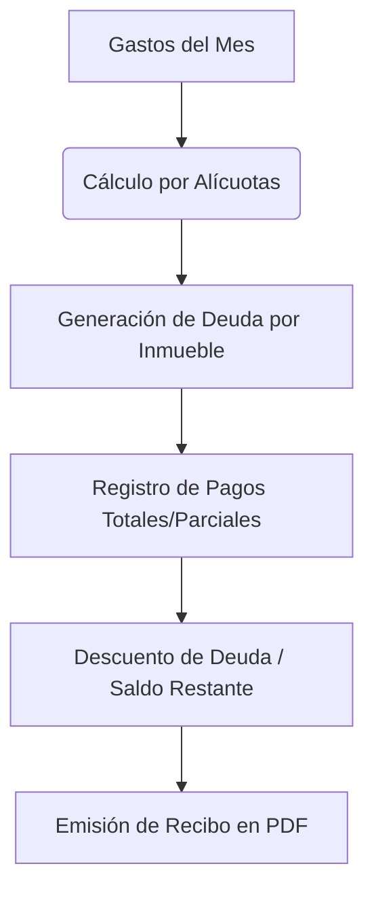

# Sistema de Administración de Condominio (SAC WEB) 🏢

> **Nota para Reclutadores:** Este repositorio contiene el proyecto final desarrollado como **Tesis de Grado**. Todo el código fuente es original. La base de datos contiene exclusivamente **datos ficticios (Mock Data)** por propósitos de demostración. Las credenciales y claves secretas han sido extraídas a variables de entorno para garantizar la seguridad.

**SAC WEB** es un sistema administrativo web completo diseñado para automatizar y gestionar condominios. Resuelve el problema matemático y logístico de la distribución justa de gastos comunes mediante el uso de "Alícuotas" (porcentaje de participación por tamaño de inmueble), automatizando cuentas por cobrar, facturación y la posterior emisión de comprobantes.

---

## 🚀 Módulos Principales

1. **Gestión de Inmuebles:** 
   *    Registro de las propiedades (Número, Propietario, Datos de contacto).
   *    Asignación de **Alícuota**, la base de todos los cálculos financieros del sistema.

2. **Facturas y Gastos:**
   *    Carga de gastos mensuales (Seguridad, Limpieza, Mantenimiento).
   *    División entre Gasto Común (todos pagan según alícuota) y Gasto No Común (reparaciones o multas a un inmueble específico).
   *    Cálculo matemático automático e instantáneo de la deuda de cada apartamento tras registrar un gasto.

3. **Pagos y Recibos:**
   *    Gestión de pagos totales o parciales en moneda local (BS) o moneda extranjera (USD) con cálculo de tasa de cambio en tiempo real.
   *    Generación automática de recibos de pago formales en formato **PDF** para descargar e imprimir.

---

## 🛠️ Stack Tecnológico

*   **Backend / Framework:** Python 3, Django 6.0
*   **Base de Datos:** SQLite (Configuración de demostración)
*   **Generación de Reportes PDF:** WeasyPrint
*   **Frontend y Diseño:** HTML5, CSS3, JavaScript (Plantillas Server-Side mediante Django Templates)
*   **Otras librerías clave:** `python-dotenv` (Gestión de secretos), `brotli` (Compresión).

---

## ⚙️ Estructura y Flujo de Datos

El núcleo principal del software se enfoca en la eficiencia administrativa:


## 💻 Instalación Local (Entorno de Desarrollo)

Para levantar este proyecto en tu entorno de desarrollo local:

1. **Clonar el repositorio:**
   ```bash
   git clone https://github.com/tu-usuario/sac_web.git
   cd sac_web
   ```

2. **Crear y activar el entorno virtual:**
   ```bash
   python -m venv venv
   source venv/bin/activate  # En Windows: venv\Scripts\activate
   ```

3. **Instalar dependencias:**
   ```bash
   pip install -r requirements.txt
   ```

4. **Configurar el entorno (.env):**
   * Crear un archivo `.env` en la raíz del proyecto.
   * Agregar la variable de seguridad: `SECRET_KEY="tu-clave-secreta-de-django"` y `DEBUG=True`.

5. **Aplicar migraciones y ejecutar el servidor:**
   ```bash
   python manage.py migrate
   python manage.py runserver
   ```
El sistema estará disponible en `http://localhost:8000/`.

---
*Desarrollado con dedicación como Proyecto Especial de Grado.*
