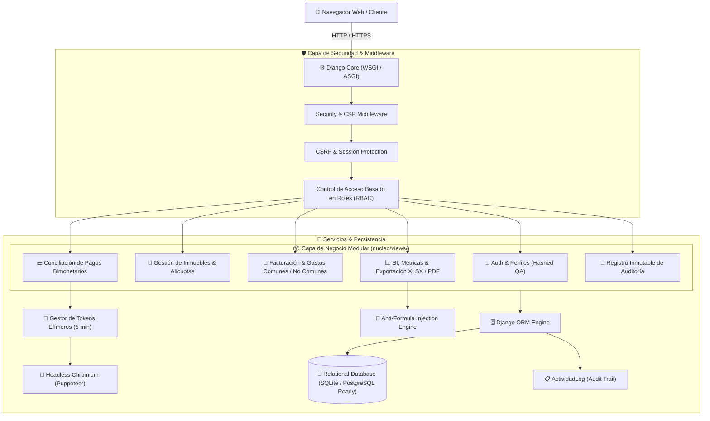
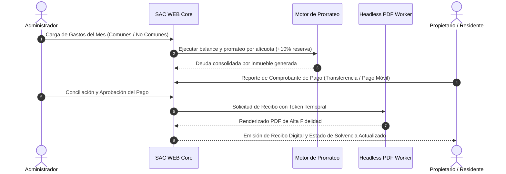

# SAC WEB — Enterprise Condominium Management & Financial System 🏢

[](https://www.python.org/)
[](https://www.djangoproject.com/)
[](https://nodejs.org/)
[](https://pptr.dev/)
[](#-arquitectura-de-seguridad-y-hardened-sast)
[](#-arquitectura-del-sistema)
[](LICENSE)

**SAC WEB** es una plataforma integral de grado empresarial diseñada para la automatización, gobernanza financiera y administración operativa de condominios y propiedades horizontales. 

El sistema centraliza la conciliación contable bimonetaria (VES / USD con actualización dinámica de tasa de cambio), el prorrateo matemático de alícuotas con fondo de reserva legal (10%), la emisión automatizada de estados de cuenta y recibos en PDF de alta fidelidad mediante motores Chromium headless, y un robusto esquema de auditoría inmutable y control de acceso basado en roles (RBAC).

---

## 🏛️ Arquitectura del Sistema

El proyecto sigue una arquitectura modular en capas desacopladas, diseñada para alta mantenibilidad, trazabilidad y cumplimiento de estándares de ciberseguridad:



---

## 🌟 Características Principales y Módulos

### 1. 🏢 Gestión Integral de Inmuebles & Alícuotas
- **Padrón de Inmuebles:** Registro detallado de unidades habitacionales, propietarios, alícuotas de participación y estado de solvencia en tiempo real.
- **Validación Estricta de Alícuotas:** Verificación matemática de consistencia (sumatoria 100%) para evitar desbalances en el prorrateo financiero.
- **Trazabilidad de Historial:** Monitoreo del historial de pagos y facturación consolidado por unidad.

### 2. 💰 Motor Financiero y Facturación Bimonetaria
- **Prorrateo Automatizado:** Distribución equitativa de gastos comunes según alícuota y asignación directa de gastos no comunes (reparaciones extraordinarias o sanciones).
- **Fondo de Reserva Legal:** Cálculo e imputación automática del 10% de reserva sobre gastos operativos.
- **Soporte Multidivisa:** Gestión transparente de saldos en Bolívares (VES) y Dólares (USD) con integración de tasa oficial y recálculo en tiempo de ejecución.
- **Conciliación de Pagos:** Registro de pagos totales o parciales, con soporte para transferencias bancarias, Pago Móvil, depósitos y divisas en efectivo.

### 3. 📄 Generación Automatizada de Recibos y Reportes PDF
- **Motor Headless Chromium:** Integración con Puppeteer para renderizado de documentos con precisión tipográfica e imprimible.
- **Autenticación Efímera Segura:** Canalización de solicitudes de generación documental mediante tokens criptográficos de un solo uso con expiración de 5 minutos, protegiendo las vistas de impresión contra accesos no autorizados.

### 4. 📊 Inteligencia de Negocios y Exportación
- **Dashboard Ejecutivo:** KPIs en tiempo real de recaudación mensual, morosidad acumulada, liquidez y distribución de gastos.
- **Exportaciones Corporativas:** Generación de balances consolidados y libros de facturación en formato Excel (.xlsx) y CSV.

---

## 🛡️ Arquitectura de Seguridad y Hardened SAST

El sistema implementa defensas en profundidad siguiendo las directrices de seguridad de **OWASP Top 10**:

| Vector de Seguridad | Mecanismo de Mitigación Implementado |
| :--- | :--- |
| **Gestión de Secretos** | Exclusión estricta de variables en código fuente (`SECRET_KEY` inyectada vía entorno `.env`). |
| **Recuperación de Cuentas** | Respuestas de seguridad hasheadas criptográficamente (`PBKDF2-SHA256`) con normalización previa. |
| **Formula Injection (CWE-1236)** | Sanitización de datos dinámicos en reportes Excel/CSV anteponiendo caracteres de escape (`'`). |
| **Validación de Archivos** | Inspección dual (extensión y tamaño máximo de 5MB) en comprobantes de pago subidos por usuarios. |
| **Cabeceras HTTP Seguras** | Configuración de políticas HSTS, X-Content-Type-Options (`nosniff`), X-Frame-Options (`DENY`) y Same-Origin Referrer. |
| **Trazabilidad Forense** | Registro inmutable de eventos (`ActividadLog`) con IP, usuario, timestamp y detalle de la operación. |

---

## ⚙️ Flujo Operativo del Sistema



---

## 🚀 Inicio Rápido (Universal Multiplataforma)

El repositorio cuenta con un orquestador inteligente y agnóstico al sistema operativo ([`iniciar.py`](file:///iniciar.py)) que automatiza el aprovisionamiento, verificación de dependencias, migración de esquemas y arranque del entorno:

```bash
python iniciar.py
```

### 🪄 Qué hace el orquestador automáticamente:
1. **Detección y Creación de Virtualenv:** Configura el entorno virtual (`venv` / `.venv`) si no existe.
2. **Sincronización de Dependencias:** Instala/actualiza los paquetes de `requirements.txt` y dependencias Node.js de Puppeteer.
3. **Generación Segura de Secretos:** Crea un archivo `.env` con una `SECRET_KEY` criptográfica si no existe.
4. **Migraciones de Base de Datos:** Ejecuta `migrate` de forma transparente.
5. **Gestión Dinámica de Puertos:** Detecta si el puerto `8000` está ocupado y asigna el siguiente disponible.
6. **Lanzamiento Asistido:** Abre la interfaz en el navegador predeterminado del sistema operativo.

---

## 💻 Despliegue Manual Paso a Paso

Si se requiere desplegar manualmente en servidores Linux / Windows Server:

```bash
# 1. Clonar el repositorio
git clone https://github.com/tu-organizacion/sac_web.git
cd sac_web

# 2. Configurar el entorno virtual
python3 -m venv venv
source venv/bin/activate  # En Windows: venv\Scripts\activate

# 3. Instalar dependencias backend y frontend
pip install -r requirements.txt
npm install

# 4. Configurar variables de entorno
cp .env.example .env
# Configurar SECRET_KEY, DEBUG=False y ALLOWED_HOSTS en .env

# 5. Ejecutar migraciones e inicializar roles
python manage.py migrate
python scripts/setup_roles.py

# 6. Iniciar el servidor de aplicaciones
python manage.py runserver 0.0.0.0:8000
```

---

## 📂 Estructura del Proyecto

```text
sac_web/
├── docs/                   # Documentación técnica, arquitectura, manuales y guías
├── nucleo/                 # Aplicación principal del sistema
│   ├── migrations/         # Esquemas y migraciones de base de datos
│   ├── templates/          # Plantillas semánticas HTML5 (Django Templates)
│   ├── views/              # Controladores modularizados por dominio de negocio
│   │   ├── api.py          # Endpoints API REST / JSON
│   │   ├── auditoria.py    # Visualización de logs de actividad y trazabilidad
│   │   ├── auth.py         # Flujos de autenticación y recuperación de credenciales
│   │   ├── facturas.py     # Gestión de facturas, gastos y prorrateo
│   │   ├── inmuebles.py    # Gestión de inmuebles y validación de alícuotas
│   │   ├── pagos.py        # Conciliación y procesamiento de pagos
│   │   ├── reportes.py     # Exportaciones XLSX / CSV y generación documental
│   │   └── usuarios.py     # Administración de usuarios y roles RBAC
│   ├── forms.py            # Formulario con validación SAST y límites de subida
│   ├── models.py           # Modelos de dominio ORM e integridad referencial
│   └── utils.py            # Utilidades de prorrateo, sanitización y divisas
├── sac_web/                # Configuración global del proyecto Django
│   ├── settings.py         # Configuración de seguridad, HSTS y middlewares
│   └── urls.py             # Enrutamiento principal del sistema
├── scripts/                # Scripts de automatización (Puppeteer, roles)
├── static/                 # Hojas de estilo CSS3, JavaScript y recursos gráficos
├── tests/                  # Suite de pruebas unitarias y de seguridad
├── .env.example            # Plantilla de variables de entorno
├── .gitignore              # Reglas herméticas de exclusión para Git
├── iniciar.py              # Orquestador universal de despliegue
├── manage.py               # CLI de administración Django
└── requirements.txt        # Dependencias verificadas de Python
```

---

## 🧪 Ejecución de Pruebas Automatizadas

El proyecto incluye un conjunto de pruebas unitarias y de integración para validar la consistencia financiera, seguridad SAST y el orquestador:

```bash
# Ejecutar la suite completa de pruebas Django
python manage.py test

# Ejecutar pruebas del orquestador universal
python -m unittest discover tests
```

---

## 📚 Documentación Técnica & Guías

La documentación detallada del sistema se encuentra centralizada en el directorio [`docs/`](docs/):

* 📖 [**Manual de Usuario Completo**](docs/MANUAL_USUARIO.md): Guía exhaustiva paso a paso para la operación de cada módulo administrativo.
* 📐 [**Diseño y Arquitectura del Sistema**](docs/DISENO_DEL_SISTEMA.md): Especificación técnica de componentes, patrones y arquitectura.
* 💰 [**Lógica Financiera y Alícuotas**](docs/LOGICA_FINANCIERA.md): Fórmulas matemáticas de prorrateo, reservas y cuentas por cobrar.
* 🛡️ [**Informe de Seguridad SAST**](docs/AUDITORIA_SEGURIDAD.md): Análisis forense y matriz de mitigación de vulnerabilidades OWASP Top 10.
* 💾 [**Guía de Migración de Servidor/PC**](docs/GUIA_MIGRACION.md): Procedimiento para respaldar y trasladar el sistema entre equipos.

---

## 📄 Licencia

Este proyecto está distribuido bajo la licencia **MIT**. Consulte el archivo `LICENSE` para obtener más información.


